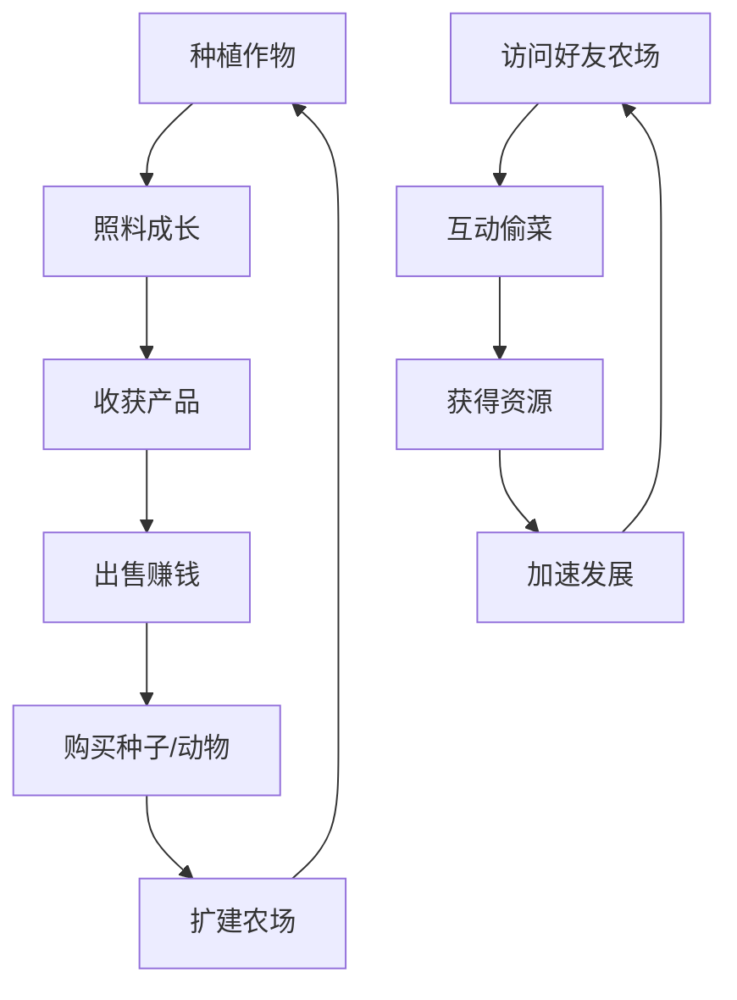
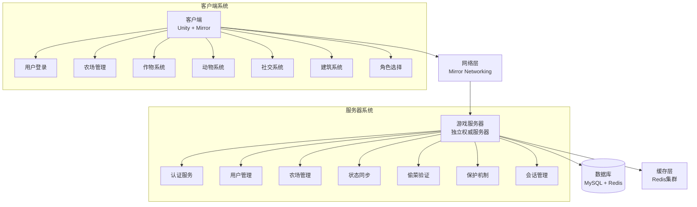
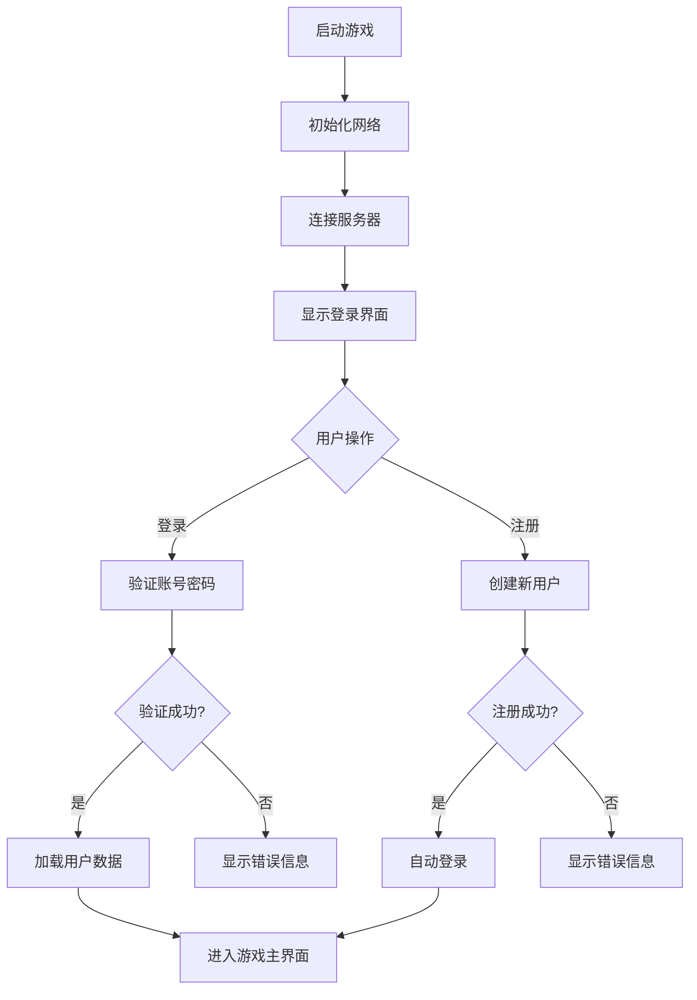
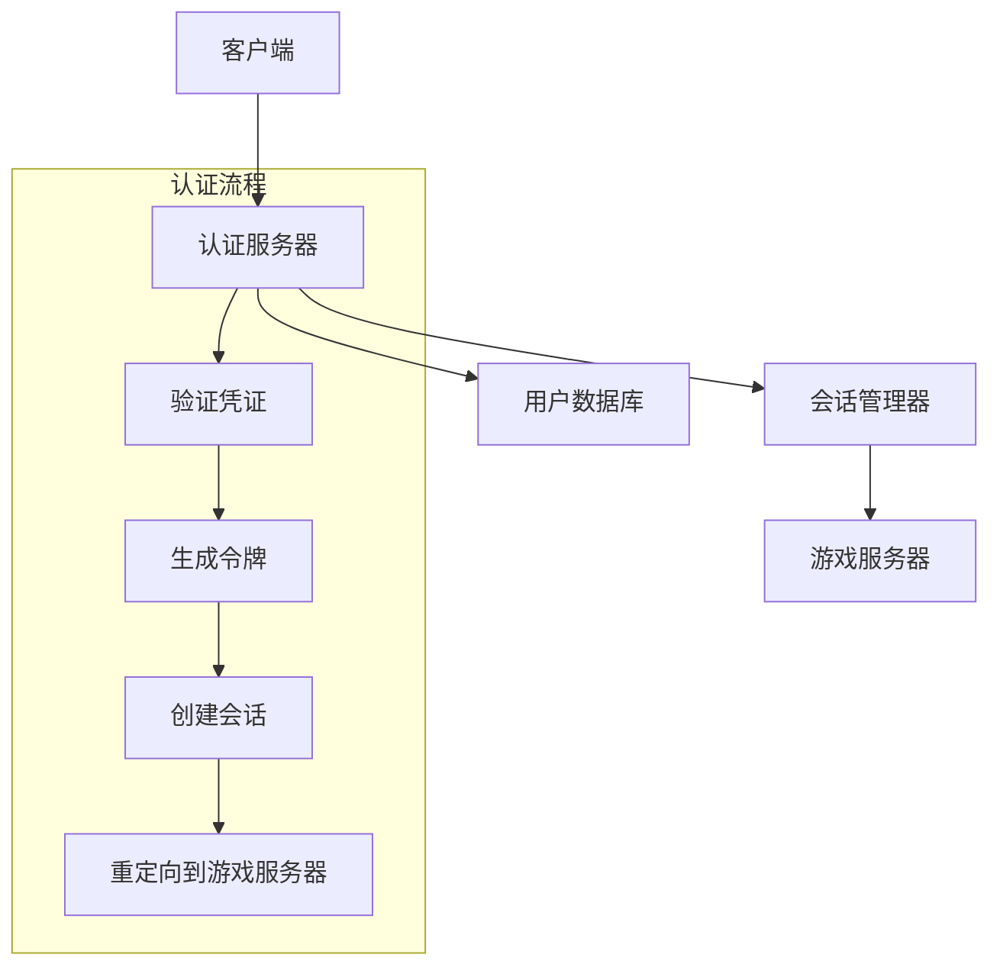
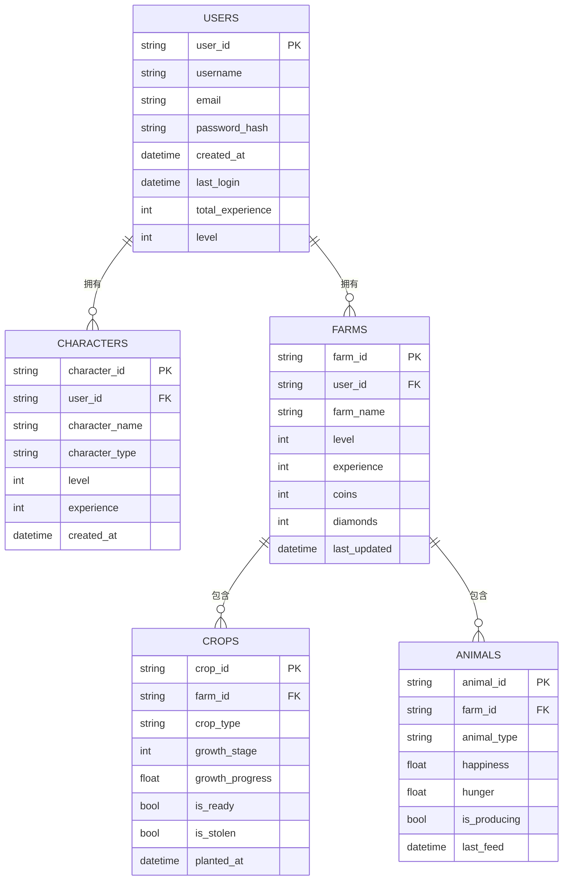
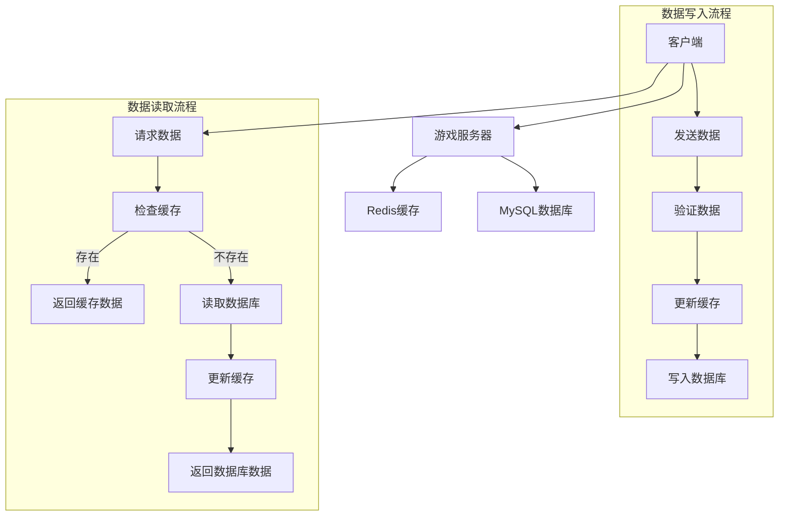
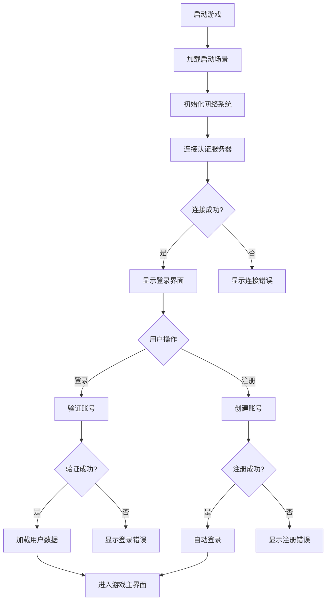

# 🌾 《开心农场Online》项目转型开发文档

## 📋 文档信息
- **项目名称**：开心农场Online
- **项目类型**：多人在线社交农场游戏
- **目标平台**：PC + 移动端
- **网络模式**：服务器-客户端模型（纯客户端连接）
- **转型目标**：将现有生存建造游戏转型为社交农场游戏

---

## 🎯 项目概述

### 核心玩法循环


### 特色功能
- ✅ **异步社交**：好友无需同时在线即可互动
- ✅ **偷菜机制**：轻度对抗增加游戏趣味
- ✅ **保护系统**：平衡被偷损失，保证玩家体验
- ✅ **跨服访问**：支持任意玩家间的农场访问
- ✅ **实时同步**：农作物生长状态实时更新

---

## 🏗️ 技术架构

### 系统架构图


### 核心模块设计

#### 0. 用户登录系统 (LoginSystem)
```csharp
// 文件路径: Assets/Scripts/Auth/LoginSystem.cs
// 功能描述: 管理用户登录、注册、会话验证
// 网络同步: 使用Command处理登录请求，TargetRpc返回结果

public class LoginSystem : NetworkBehaviour
{
    [Header("登录配置")]
    public string serverAddress = "127.0.0.1";
    public int serverPort = 7777;
    
    /// <summary>
    /// 用户登录 - 客户端发起
    /// </summary>
    [Command(requiresAuthority = false)]
    public void CmdUserLogin(string username, string password)
    {
        // 验证登录信息
        if (!AuthService.ValidateCredentials(username, password))
        {
            TargetLoginResult(connectionToClient, false, "用户名或密码错误");
            return;
        }
        
        // 检查会话状态
        if (SessionManager.IsUserOnline(username))
        {
            TargetLoginResult(connectionToClient, false, "用户已在线");
            return;
        }
        
        // 创建会话
        string sessionId = SessionManager.CreateSession(username, connectionToClient);
        
        // 加载用户数据
        UserData userData = DatabaseManager.LoadUserData(username);
        
        // 返回登录成功
        TargetLoginResult(connectionToClient, true, "登录成功", userData);
        
        // 切换到游戏场景
        RpcSwitchToGameScene();
    }
    
    /// <summary>
    /// 用户注册 - 客户端发起
    /// </summary>
    [Command(requiresAuthority = false)]
    public void CmdUserRegister(string username, string password, string email)
    {
        // 验证注册信息
        if (!AuthService.ValidateRegistration(username, password, email))
        {
            TargetRegisterResult(connectionToClient, false, "注册信息无效");
            return;
        }
        
        // 检查用户是否存在
        if (DatabaseManager.UserExists(username))
        {
            TargetRegisterResult(connectionToClient, false, "用户名已存在");
            return;
        }
        
        // 创建用户
        bool success = DatabaseManager.CreateUser(username, password, email);
        
        // 返回注册结果
        TargetRegisterResult(connectionToClient, success, success ? "注册成功" : "注册失败");
    }
    
    /// <summary>
    /// 登录结果回调
    /// </summary>
    [TargetRpc]
    public void TargetLoginResult(NetworkConnectionToClient target, bool success, string message, UserData userData = null)
    {
        // 客户端处理登录结果
        UILogin.Instance.OnLoginResult(success, message, userData);
    }
    
    /// <summary>
    /// 注册结果回调
    /// </summary>
    [TargetRpc]
    public void TargetRegisterResult(NetworkConnectionToClient target, bool success, string message)
    {
        // 客户端处理注册结果
        UILogin.Instance.OnRegisterResult(success, message);
    }
    
    /// <summary>
    /// 切换到游戏场景
    /// </summary>
    [ClientRpc]
    public void RpcSwitchToGameScene()
    {
        SceneManager.LoadScene("GameScene");
    }
}
```

#### 1. 农作物系统 (CropSystem)
```csharp
// 文件路径: Assets/Scripts/Farm/CropSystem.cs
// 功能描述: 管理农作物的种植、生长、收获全生命周期
// 网络同步: 使用SyncVar同步生长状态，Command处理种植收获

public class CropSystem : NetworkBehaviour
{
    [Header("作物数据")]
    [SyncVar(hook = nameof(OnGrowthStageChanged))]
    public int growthStage = 0;
    
    [SyncVar]
    public float growthProgress = 0f;
    
    [SyncVar]
    public string cropId = "";
    
    [SyncVar]
    public bool isReady = false;
    
    [SyncVar]
    public bool isStolen = false;
    
    private CropData cropData;
    private float serverStartTime;
    
    /// <summary>
    /// 种植作物 - 由玩家发起
    /// </summary>
    [Command(requiresAuthority = false)]
    public void CmdPlantCrop(string cropId, Vector3 position)
    {
        // 验证种植条件
        if (!CanPlantCrop(cropId, position)) return;
        
        // 扣除种子
        if (!DeductSeedsFromInventory(cropId)) return;
        
        // 种植逻辑
        this.cropId = cropId;
        this.growthStage = 0;
        this.growthProgress = 0f;
        this.isReady = false;
        this.isStolen = false;
        this.serverStartTime = NetworkTime.time;
        
        cropData = CropDatabase.GetCropData(cropId);
        
        // 广播种植事件
        RpcOnCropPlanted(cropId, position);
        
        // 开始生长协程
        StartCoroutine(GrowthCoroutine());
    }
    
    /// <summary>
    /// 收获作物 - 由玩家发起
    /// </summary>
    [Command(requiresAuthority = false)]
    public void CmdHarvestCrop()
    {
        // 验证收获条件
        if (!isReady || isStolen) return;
        
        // 计算收获数量（基础数量 + 随机浮动）
        int baseQuantity = cropData.baseHarvestQuantity;
        int bonusQuantity = CalculateBonusQuantity();
        int totalQuantity = baseQuantity + bonusQuantity;
        
        // 添加到玩家背包
        GivePlayerItems(cropId, totalQuantity);
        
        // 给予经验
        GivePlayerExperience(cropData.harvestExperience);
        
        // 重置作物状态
        ResetCropState();
        
        // 广播收获事件
        RpcOnCropHarvested(totalQuantity);
    }
    
    /// <summary>
    /// 尝试偷取作物 - 由访客发起
    /// </summary>
    [Command(requiresAuthority = false)]
    public void CmdStealCrop(NetworkConnectionToClient sender)
    {
        // 验证偷取条件
        if (!CanStealCrop(sender)) return;
        
        // 计算偷取数量（最多30%）
        int stealQuantity = Mathf.CeilToInt(cropData.baseHarvestQuantity * 0.3f);
        
        // 给访客添加物品
        TargetAddItemsToVisitor(sender, cropId, stealQuantity);
        
        // 标记为被偷
        isStolen = true;
        
        // 记录偷取日志
        LogStealActivity(sender.identity.GetComponent<NetworkPlayer>().playerName, stealQuantity);
        
        // 广播偷取事件
        RpcOnCropStolen(sender.identity.GetComponent<NetworkPlayer>().playerName, stealQuantity);
    }
    
    /// <summary>
    /// 生长协程 - 服务器端控制
    /// </summary>
    private IEnumerator GrowthCoroutine()
    {
        while (growthStage < cropData.growthStages.Length - 1)
        {
            float growthTime = cropData.growthTimePerStage[growthStage];
            float elapsedTime = 0f;
            
            while (elapsedTime < growthTime)
            {
                elapsedTime += Time.deltaTime;
                growthProgress = elapsedTime / growthTime;
                yield return null;
            }
            
            // 进入下一阶段
            growthStage++;
            growthProgress = 0f;
            
            // 广播生长阶段变化
            RpcOnGrowthStageChanged(growthStage);
        }
        
        // 作物成熟
        isReady = true;
        RpcOnCropReady();
    }
    
    /// <summary>
    /// 验证是否可以种植
    /// </summary>
    private bool CanPlantCrop(string cropId, Vector3 position)
    {
        // 检查土地是否可用
        if (!string.IsNullOrEmpty(this.cropId)) return false;
        
        // 检查玩家是否有种子
        NetworkPlayer player = NetworkServer.connections.Values
            .Select(conn => conn.identity?.GetComponent<NetworkPlayer>())
            .FirstOrDefault(p => p != null);
            
        if (player == null || !player.HasItem(cropId, 1)) return false;
        
        // 检查种植季节
        CropData data = CropDatabase.GetCropData(cropId);
        if (!IsCorrectSeason(data.season)) return false;
        
        return true;
    }
    
    /// <summary>
    /// 验证是否可以偷取
    /// </summary>
    private bool CanStealCrop(NetworkConnectionToClient sender)
    {
        // 检查作物是否成熟
        if (!isReady || isStolen) return false;
        
        // 检查保护状态
        FarmProtectionSystem protection = GetComponent<FarmProtectionSystem>();
        if (protection != null && protection.IsProtected) return false;
        
        // 检查偷取次数限制
        NetworkPlayer thief = sender.identity.GetComponent<NetworkPlayer>();
        if (thief.GetDailyStealCount() >= GameBalance.MaxDailySteals) return false;
        
        return true;
    }
}
```

#### 2. 角色选择系统 (CharacterSystem)
```csharp
// 文件路径: Assets/Scripts/Character/CharacterSystem.cs
// 功能描述: 管理角色选择、创建和切换
// 网络同步: 使用SyncVar同步角色状态，Command处理角色操作

public class CharacterSystem : NetworkBehaviour
{
    [Header("角色数据")]
    [SyncVar(hook = nameof(OnCharacterChanged))]
    public string currentCharacterId = "";
    
    [SyncVar]
    public int characterLevel = 1;
    
    [SyncVar]
    public int characterExperience = 0;
    
    private CharacterData currentCharacterData;
    private List<CharacterData> availableCharacters = new List<CharacterData>();
    
    /// <summary>
    /// 初始化角色列表 - 服务器端
    /// </summary>
    public override void OnStartServer()
    {
        base.OnStartServer();
        
        // 加载可用角色数据
        availableCharacters = CharacterDatabase.GetAllCharacters();
    }
    
    /// <summary>
    /// 获取可用角色列表 - 客户端请求
    /// </summary>
    [Command]
    public void CmdGetAvailableCharacters()
    {
        // 发送角色列表给客户端
        TargetSendCharacterList(connectionToClient, availableCharacters.ToArray());
    }
    
    /// <summary>
    /// 选择角色 - 客户端发起
    /// </summary>
    [Command]
    public void CmdSelectCharacter(string characterId)
    {
        // 验证角色是否可用
        if (!IsCharacterAvailable(characterId))
        {
            TargetCharacterSelectResult(connectionToClient, false, "角色不可用");
            return;
        }
        
        // 检查用户是否拥有该角色
        if (!UserHasCharacter(connectionToClient, characterId))
        {
            TargetCharacterSelectResult(connectionToClient, false, "未拥有该角色");
            return;
        }
        
        // 更新当前角色
        currentCharacterId = characterId;
        currentCharacterData = CharacterDatabase.GetCharacterData(characterId);
        
        // 发送选择结果
        TargetCharacterSelectResult(connectionToClient, true, "角色选择成功");
        
        // 广播角色变更
        RpcOnCharacterChanged(characterId);
    }
    
    /// <summary>
    /// 创建新角色 - 客户端发起
    /// </summary>
    [Command]
    public void CmdCreateCharacter(string characterId, string customName)
    {
        // 验证角色是否可创建
        if (!CanCreateCharacter(characterId))
        {
            TargetCharacterCreateResult(connectionToClient, false, "无法创建该角色");
            return;
        }
        
        // 检查用户角色数量限制
        if (GetUserCharacterCount(connectionToClient) >= GameBalance.MaxCharactersPerUser)
        {
            TargetCharacterCreateResult(connectionToClient, false, "角色数量已达上限");
            return;
        }
        
        // 创建角色
        bool success = CharacterManager.CreateCharacter(connectionToClient, characterId, customName);
        
        // 发送创建结果
        TargetCharacterCreateResult(connectionToClient, success, success ? "角色创建成功" : "角色创建失败");
    }
    
    /// <summary>
    /// 角色变更回调
    /// </summary>
    private void OnCharacterChanged(string newCharacterId)
    {
        currentCharacterData = CharacterDatabase.GetCharacterData(newCharacterId);
        // 更新角色显示
        UpdateCharacterDisplay();
    }
    
    /// <summary>
    /// 发送角色列表给客户端
    /// </summary>
    [TargetRpc]
    public void TargetSendCharacterList(NetworkConnectionToClient target, CharacterData[] characters)
    {
        // 客户端处理角色列表
        UICharacterSelect.Instance.OnCharacterListReceived(characters);
    }
}
```

#### 3. 社交系统 (SocialSystem)
```csharp
// 文件路径: Assets/Scripts/Social/SocialSystem.cs
// 功能描述: 管理好友关系、世界频道、农场访问
// 网络同步: 使用SyncList同步好友列表，TargetRpc处理私密消息

public class SocialSystem : NetworkBehaviour
{
    [System.Serializable]
    public class FriendData
    {
        public string playerId;
        public string playerName;
        public int farmLevel;
        public bool isOnline;
        public int intimacyLevel;
        public long lastInteractionTime;
    }
    
    [SyncVar(hook = nameof(OnFriendsListUpdated))]
    private SyncList<FriendData> friendsList = new SyncList<FriendData>();
    
    [SyncVar(hook = nameof(OnOnlinePlayersUpdated))]
    private SyncList<string> onlinePlayers = new SyncList<string>();
    
    /// <summary>
    /// 添加好友 - 发送好友请求
    /// </summary>
    [Command]
    public void CmdAddFriend(string targetPlayerId)
    {
        // 验证是否可以添加好友
        if (IsAlreadyFriend(targetPlayerId)) return;
        
        // 发送好友请求给目标玩家
        NetworkPlayer targetPlayer = GetPlayerById(targetPlayerId);
        if (targetPlayer != null)
        {
            targetPlayer.GetComponent<SocialSystem>().TargetReceiveFriendRequest(
                connectionToClient, 
                NetworkServer.localConnection.identity.GetComponent<NetworkPlayer>().playerName
            );
        }
    }
    
    /// <summary>
    /// 接受好友请求
    /// </summary>
    [Command]
    public void CmdAcceptFriendRequest(string requesterId)
    {
        NetworkPlayer requester = GetPlayerById(requesterId);
        NetworkPlayer accepter = NetworkServer.localConnection.identity.GetComponent<NetworkPlayer>();
        
        // 双向添加好友
        AddFriendToList(requesterId, requester.playerName);
        requester.GetComponent<SocialSystem>().AddFriendToList(
            accepter.playerId, 
            accepter.playerName
        );
        
        // 增加亲密度
        IncreaseIntimacy(requesterId, 10);
        requester.GetComponent<SocialSystem>().IncreaseIntimacy(accepter.playerId, 10);
    }
    
    /// <summary>
    /// 访问好友农场
    /// </summary>
    [Command]
    public void CmdVisitFriendFarm(string friendId)
    {
        // 验证好友关系
        if (!IsAlreadyFriend(friendId)) return;
        
        NetworkPlayer friend = GetPlayerById(friendId);
        if (friend == null) return;
        
        // 获取好友农场数据
        FarmData friendFarm = FarmDataManager.Instance.GetPlayerFarm(friendId);
        if (friendFarm == null) return;
        
        // 发送农场数据给访客
        TargetSendFarmData(connectionToClient, friendFarm);
        
        // 记录访问日志
        LogFarmVisit(friendId);
        
        // 增加亲密度
        IncreaseIntimacy(friendId, 2);
        friend.GetComponent<SocialSystem>().IncreaseIntimacy(
            NetworkServer.localConnection.identity.GetComponent<NetworkPlayer>().playerId, 
            2
        );
    }
    
    /// <summary>
    /// 搜索可访问的农场
    /// </summary>
    [Command]
    public void CmdSearchFarms(string searchCriteria)
    {
        List<FarmSearchResult> results = new List<FarmSearchResult>();
        
        // 获取所有在线玩家的农场信息
        foreach (string playerId in onlinePlayers)
        {
            if (playerId == NetworkServer.localConnection.identity.GetComponent<NetworkPlayer>().playerId)
                continue;
                
            NetworkPlayer player = GetPlayerById(playerId);
            if (player == null) continue;
            
            FarmData farm = FarmDataManager.Instance.GetPlayerFarm(playerId);
            if (farm == null) continue;
            
            // 检查搜索条件
            if (string.IsNullOrEmpty(searchCriteria) || 
                player.playerName.Contains(searchCriteria) ||
                farm.farmName.Contains(searchCriteria))
            {
                results.Add(new FarmSearchResult
                {
                    playerId = playerId,
                    playerName = player.playerName,
                    farmName = farm.farmName,
                    farmLevel = farm.level,
                    isFriend = IsAlreadyFriend(playerId),
                    canVisit = CanVisitFarm(playerId)
                });
            }
        }
        
        // 发送搜索结果
        TargetSendSearchResults(connectionToClient, results.ToArray());
    }
    
    /// <summary>
    /// 发送世界消息
    /// </summary>
    [Command]
    public void CmdSendWorldMessage(string message)
    {
        // 验证消息长度和内容
        if (string.IsNullOrEmpty(message) || message.Length > 200) return;
        
        // 过滤敏感词
        string filteredMessage = FilterMessage(message);
        
        // 获取发送者信息
        NetworkPlayer sender = NetworkServer.localConnection.identity.GetComponent<NetworkPlayer>();
        
        // 广播给所有在线玩家
        foreach (NetworkConnection conn in NetworkServer.connections.Values)
        {
            if (conn != null && conn.identity != null)
            {
                TargetReceiveWorldMessage(conn, sender.playerName, filteredMessage);
            }
        }
        
        // 记录聊天日志
        LogChatMessage(sender.playerId, filteredMessage);
    }
}
```

#### 4. 网络启动系统 (NetworkBootstrapSystem)
```csharp
// 文件路径: Assets/Scripts/Network/NetworkBootstrapSystem.cs
// 功能描述: 管理网络启动流程，从登录界面初始化连接
// 网络同步: 纯客户端初始化，无服务器逻辑

public class NetworkBootstrapSystem : MonoBehaviour
{
    [Header("网络配置")]
    public string defaultServerAddress = "127.0.0.1";
    public int defaultServerPort = 7777;
    
    private GameNetworkManager networkManager;
    
    /// <summary>
    /// 初始化网络系统
    /// </summary>
    public void InitializeNetwork()
    {
        // 获取网络管理器
        networkManager = FindObjectOfType<GameNetworkManager>();
        
        if (networkManager == null)
        {
            Debug.LogError("未找到GameNetworkManager组件");
            return;
        }
        
        // 配置网络参数
        networkManager.networkAddress = defaultServerAddress;
        networkManager.networkPort = defaultServerPort;
        
        // 注册网络事件
        RegisterNetworkEvents();
    }
    
    /// <summary>
    /// 连接到服务器
    /// </summary>
    public void ConnectToServer(string serverAddress, int serverPort)
    {
        if (networkManager == null)
        {
            Debug.LogError("网络管理器未初始化");
            return;
        }
        
        // 更新服务器地址
        networkManager.networkAddress = serverAddress;
        networkManager.networkPort = serverPort;
        
        // 启动客户端
        networkManager.StartClient();
        
        Debug.Log("正在连接到服务器: " + serverAddress + ":" + serverPort);
    }
    
    /// <summary>
    /// 断开与服务器的连接
    /// </summary>
    public void DisconnectFromServer()
    {
        if (networkManager != null && networkManager.isNetworkActive)
        {
            networkManager.StopClient();
            Debug.Log("已断开与服务器的连接");
        }
    }
    
    /// <summary>
    /// 注册网络事件
    /// </summary>
    private void RegisterNetworkEvents()
    {
        networkManager.OnClientConnectCallback += OnClientConnected;
        networkManager.OnClientDisconnectCallback += OnClientDisconnected;
        networkManager.OnClientErrorCallback += OnClientError;
    }
    
    /// <summary>
    /// 客户端连接成功回调
    /// </summary>
    private void OnClientConnected()
    {
        Debug.Log("客户端连接成功");
        // 连接成功后显示登录界面
        UILogin.Instance.ShowLoginUI();
    }
    
    /// <summary>
    /// 客户端断开连接回调
    /// </summary>
    private void OnClientDisconnected()
    {
        Debug.Log("客户端断开连接");
        // 断开连接后显示重新连接界面
        UILogin.Instance.ShowReconnectUI();
    }
    
    /// <summary>
    /// 客户端错误回调
    /// </summary>
    private void OnClientError(Exception exception)
    {
        Debug.LogError("客户端错误: " + exception.Message);
        // 显示错误信息
        UILogin.Instance.ShowError("连接失败: " + exception.Message);
    }
}
```

#### 5. 农场保护系统 (FarmProtectionSystem)
```csharp
// 文件路径: Assets/Scripts/Farm/FarmProtectionSystem.cs
// 功能描述: 管理农场的偷菜保护机制
// 网络同步: 使用SyncVar同步保护状态和时间

public class FarmProtectionSystem : NetworkBehaviour
{
    [Header("保护设置")]
    [SyncVar(hook = nameof(OnProtectionChanged))]
    public bool isProtected = false;
    
    [SyncVar(hook = nameof(OnProtectionTimeChanged))]
    public float protectionTimeRemaining = 0f;
    
    [SyncVar]
    public string activatedBy = "";
    
    private Coroutine protectionCoroutine;
    
    /// <summary>
    /// 激活保护 - 消耗道具激活
    /// </summary>
    [Command]
    public void CmdActivateProtection(int hours)
    {
        // 验证保护道具
        string protectionItemId = GetProtectionItemId(hours);
        NetworkPlayer player = NetworkServer.localConnection.identity.GetComponent<NetworkPlayer>();
        
        if (!player.HasItem(protectionItemId, 1))
        {
            TargetShowMessage(connectionToClient, "保护道具不足！");
            return;
        }
        
        // 扣除道具
        player.ConsumeItem(protectionItemId, 1);
        
        // 激活保护
        ActivateProtection(hours, player.playerId);
        
        // 广播保护激活
        RpcOnProtectionActivated(hours, player.playerName);
    }
    
    /// <summary>
    /// 激活保护逻辑
    /// </summary>
    private void ActivateProtection(int hours, string playerId)
    {
        isProtected = true;
        protectionTimeRemaining = hours * 3600f; // 转换为秒
        activatedBy = playerId;
        
        // 停止之前的协程
        if (protectionCoroutine != null)
            StopCoroutine(protectionCoroutine);
        
        // 开始新的保护协程
        protectionCoroutine = StartCoroutine(ProtectionCoroutine());
    }
    
    /// <summary>
    /// 保护倒计时协程
    /// </summary>
    private IEnumerator ProtectionCoroutine()
    {
        while (protectionTimeRemaining > 0)
        {
            yield return new WaitForSeconds(1f);
            protectionTimeRemaining -= 1f;
            
            // 同步保护时间
            RpcSyncProtectionTime(protectionTimeRemaining);
        }
        
        // 保护时间结束
        isProtected = false;
        activatedBy = "";
        RpcOnProtectionEnded();
    }
    
    /// <summary>
    /// 检查是否可以偷取
    /// </summary>
    public bool CanSteal()
    {
        return !isProtected && protectionTimeRemaining <= 0;
    }
    
    /// <summary>
    /// 获取剩余保护时间显示
    /// </summary>
    public string GetProtectionTimeText()
    {
        if (!isProtected) return "";
        
        TimeSpan timeSpan = TimeSpan.FromSeconds(protectionTimeRemaining);
        if (timeSpan.TotalDays >= 1)
            return $"保护中 ({timeSpan.Days}天{timeSpan.Hours}小时)";
        else if (timeSpan.TotalHours >= 1)
            return $"保护中 ({timeSpan.Hours}小时{timeSpan.Minutes}分钟)";
        else
            return $"保护中 ({timeSpan.Minutes}分钟)";
    }
}
```

---

## 📊 数据配置设计

### 农作物配置 (CropData.json)
```json
{
  "crops": [
    {
      "id": "carrot",
      "name": "胡萝卜",
      "growthTime": 300,
      "growthStages": 4,
      "baseHarvestQuantity": 3,
      "basePrice": 10,
      "experience": 5,
      "season": "Spring",
      "waterNeeded": 2,
      "fertilizerNeeded": 1,
      "spritePaths": [
        "Sprites/Crops/Carrot_Stage0",
        "Sprites/Crops/Carrot_Stage1",
        "Sprites/Crops/Carrot_Stage2",
        "Sprites/Crops/Carrot_Stage3"
      ]
    },
    {
      "id": "tomato",
      "name": "番茄",
      "growthTime": 600,
      "growthStages": 5,
      "baseHarvestQuantity": 5,
      "basePrice": 25,
      "experience": 12,
      "season": "Summer",
      "waterNeeded": 3,
      "fertilizerNeeded": 2,
      "spritePaths": [
        "Sprites/Crops/Tomato_Stage0",
        "Sprites/Crops/Tomato_Stage1",
        "Sprites/Crops/Tomato_Stage2",
        "Sprites/Crops/Tomato_Stage3",
        "Sprites/Crops/Tomato_Stage4"
      ]
    },
    {
      "id": "wheat",
      "name": "小麦",
      "growthTime": 1200,
      "growthStages": 6,
      "baseHarvestQuantity": 10,
      "basePrice": 50,
      "experience": 25,
      "season": "Autumn",
      "waterNeeded": 4,
      "fertilizerNeeded": 3,
      "spritePaths": [
        "Sprites/Crops/Wheat_Stage0",
        "Sprites/Crops/Wheat_Stage1",
        "Sprites/Crops/Wheat_Stage2",
        "Sprites/Crops/Wheat_Stage3",
        "Sprites/Crops/Wheat_Stage4",
        "Sprites/Crops/Wheat_Stage5"
      ]
    }
  ]
}
```

### 服务器统一登录机制

#### 登录流程设计


#### 服务器认证架构


### 动物配置 (AnimalData.json)
```json
{
  "animals": [
    {
      "id": "chicken",
      "name": "鸡",
      "type": "Poultry",
      "happinessDecay": 0.1,
      "hungerDecay": 0.2,
      "productionTime": 3600,
      "productId": "egg",
      "productName": "鸡蛋",
      "baseProductQuantity": 1,
      "basePrice": 15,
      "experience": 8,
      "feedNeeded": "chicken_feed",
      "shelterType": "coop",
      "spritePath": "Sprites/Animals/Chicken"
    },
    {
      "id": "cow",
      "name": "牛",
      "type": "Livestock",
      "happinessDecay": 0.05,
      "hungerDecay": 0.15,
      "productionTime": 7200,
      "productId": "milk",
      "productName": "牛奶",
      "baseProductQuantity": 3,
      "basePrice": 30,
      "experience": 20,
      "feedNeeded": "cow_feed",
      "shelterType": "barn",
      "spritePath": "Sprites/Animals/Cow"
    }
  ]
}
```

### 数据库存储系统设计

#### 数据库架构


#### 数据存储流程


### 建筑配置 (FarmBuildingData.json)
```json
{
  "buildings": [
    {
      "id": "coop",
      "name": "鸡舍",
      "type": "AnimalShelter",
      "maxAnimals": 8,
      "buildCost": {
        "wood": 50,
        "stone": 20,
        "coins": 500
      },
      "unlockLevel": 3,
      "constructionTime": 300,
      "spritePath": "Sprites/Buildings/Coop"
    },
    {
      "id": "barn",
      "name": "谷仓",
      "type": "AnimalShelter",
      "maxAnimals": 4,
      "buildCost": {
        "wood": 100,
        "stone": 50,
        "coins": 1000
      },
      "unlockLevel": 5,
      "constructionTime": 600,
      "spritePath": "Sprites/Buildings/Barn"
    },
    {
      "id": "well",
      "name": "水井",
      "type": "Utility",
      "effect": "AutoWatering",
      "range": 3,
      "buildCost": {
        "stone": 30,
        "coins": 300
      },
      "unlockLevel": 2,
      "constructionTime": 180,
      "spritePath": "Sprites/Buildings/Well"
    }
  ]
}
```

---

## 🎮 用户界面设计

### 游戏启动流程重构

#### 新启动流程


#### 场景结构变化
```
项目场景结构
├── LoginScene.unity      # 登录场景（原Character场景替换）
├── GameScene.unity       # 游戏主场景
└── LoadingScene.unity    # 加载场景
```

### 主界面布局
```
┌─────────────────────────────────────────────────────────────┐
│  [头像] 玩家名 Lv.15  🪙 12580  💎 258  [设置] [好友] [商店] │
├─────────────────────────────────────────────────────────────┤
│                                                             │
│                    农场主视图区域                            │
│                                                             │
│  ┌─────────┐                                               │
│  │  快捷栏  │  [种子] [工具] [动物] [建筑]                  │
│  │ [胡萝卜] │                                               │
│  │ [番茄]   │  [土地1] [土地2] [土地3] [土地4] [土地5]      │
│  │ [小麦]   │                                               │
│  └─────────┘                                               │
│                                                             │
│  [世界频道] [我的农场] [好友农场] [搜索] [背包] [任务]      │
└─────────────────────────────────────────────────────────────┘
```

### 社交界面设计
```
┌─────────────────────────────────────────────────────────────┐
│                    世界频道                                  │
├─────────────────────────────────────────────────────────────┤
│  [搜索框] [搜索] [刷新]                                     │
│                                                             │
│  玩家列表：                                                  │
│  ┌─────────────────────────────────────────────────────┐    │
│  │ [头像] 小明的农场  Lv.12  🌟🌟🌟  [访问] [添加好友] │    │
│  │ 状态：在线  保护：2小时30分钟                        │    │
│  └─────────────────────────────────────────────────────┘    │
│  ┌─────────────────────────────────────────────────────┐    │
│  │ [头像] 小红的家园  Lv.8   🌟🌟    [访问] [添加好友] │    │
│  │ 状态：离线  上次在线：2小时前                        │    │
│  └─────────────────────────────────────────────────────┘    │
│                                                             │
│  [上一页] [1] [2] [3] [4] [5] [下一页]                     │
└─────────────────────────────────────────────────────────────┘
```

---

## 🔧 开发实施指南

### 第一阶段：核心系统开发（2-3周）

#### 第1周：基础架构搭建
- **Day 1-2**: 创建农场场景和基础地形
  - 创建 `FarmScene.unity`
  - 设计农场地图布局（土地、道路、装饰区域）
  - 导入农场主题资源包

- **Day 3-4**: 农作物系统核心实现
  - 实现 `Crop.cs` 基础类
  - 创建 `CropData.cs` 数据类
  - 配置 `CropData.json` 数据文件
  - 实现种植和收获逻辑

- **Day 5-7**: 网络同步集成
  - 集成 Mirror 网络同步
  - 实现种植收获的 Command/Rpc
  - 测试多人种植收获功能

#### 第2周：功能完善和UI开发
- **Day 8-10**: 生长系统实现
  - 实现服务器端生长计时
  - 添加生长阶段变化
  - 实现成熟状态检测
  - 添加生长进度显示

- **Day 11-14**: 用户界面开发
  - 设计主界面布局
  - 实现快捷栏系统
  - 创建背包界面
  - 添加工具选择功能

#### 第3周：动物系统和优化
- **Day 15-18**: 动物系统开发
  - 实现 `Animal.cs` 基础类
  - 创建动物AI行为
  - 实现喂养和生产机制
  - 添加动物产品收获

- **Day 19-21**: 性能优化和测试
  - 优化对象池使用
  - 减少网络同步频率
  - 添加错误处理机制
  - 进行压力测试

### 第二阶段：社交系统开发（2-3周）

#### 第4周：基础社交功能
- **Day 22-25**: 好友系统实现
  - 实现好友添加逻辑
  - 创建好友列表界面
  - 实现好友状态同步
  - 添加好友访问功能

- **Day 26-28**: 世界频道开发
  - 实现玩家搜索功能
  - 创建世界频道界面
  - 实现农场列表展示
  - 添加访问请求处理

#### 第5周：偷菜机制实现
- **Day 29-32**: 偷菜系统核心
  - 实现偷取验证逻辑
  - 创建偷菜动画效果
  - 实现被偷记录功能
  - 添加偷菜收益计算

- **Day 33-35**: 保护系统开发
  - 实现保护道具功能
  - 创建保护时间计时
  - 添加保护状态显示
  - 实现保护激活逻辑

#### 第6周：高级功能和优化
- **Day 36-39**: 亲密度系统
  - 实现亲密度计算
  - 创建亲密度界面
  - 添加亲密度奖励
  - 实现互动记录

- **Day 40-42**: 系统整合测试
  - 集成所有社交功能
  - 测试多人互动场景
  - 优化网络性能
  - 修复发现的问题

### 第三阶段：商业化功能（1-2周）

#### 第7周：货币和商店系统
- **Day 43-45**: 货币系统实现
  - 实现金币和钻石系统
  - 创建货币获取途径
  - 添加消费记录功能
  - 实现货币同步机制

- **Day 46-49**: 商店系统开发
  - 创建商店界面
  - 实现商品购买逻辑
  - 添加道具使用效果
  - 实现商店数据配置

#### 第8周：任务和成就系统
- **Day 50-52**: 任务系统实现
  - 创建任务数据结构
  - 实现任务进度跟踪
  - 添加任务奖励发放
  - 实现每日任务刷新

- **Day 53-56**: 成就系统开发
  - 设计成就类型
  - 实现成就解锁逻辑
  - 创建成就展示界面
  - 添加成就奖励机制

---

## 📱 移动端适配方案

### 触控操作优化
```csharp
// 文件路径: Assets/Scripts/UI/MobileInputHandler.cs
public class MobileInputHandler : MonoBehaviour, IPointerDownHandler, IPointerUpHandler, IDragHandler
{
    [Header("触控设置")]
    public float tapMaxDistance = 30f;
    public float longPressDuration = 0.5f;
    public float dragThreshold = 10f;
    
    private Vector2 touchStartPosition;
    private float touchStartTime;
    private bool isDragging = false;
    private bool isLongPress = false;
    
    public void OnPointerDown(PointerEventData eventData)
    {
        touchStartPosition = eventData.position;
        touchStartTime = Time.time;
        isDragging = false;
        isLongPress = false;
        
        // 开始长按检测协程
        StartCoroutine(LongPressDetection(eventData));
    }
    
    public void OnDrag(PointerEventData eventData)
    {
        if (!isDragging)
        {
            float dragDistance = Vector2.Distance(touchStartPosition, eventData.position);
            if (dragDistance > dragThreshold)
            {
                isDragging = true;
                // 开始拖拽操作
                OnDragStart(eventData);
            }
        }
        else
        {
            // 处理拖拽中
            OnDragUpdate(eventData);
        }
    }
    
    public void OnPointerUp(PointerEventData eventData)
    {
        StopAllCoroutines();
        
        if (!isDragging && !isLongPress)
        {
            // 处理点击操作
            OnTap(eventData);
        }
        else if (isDragging)
        {
            // 处理拖拽结束
            OnDragEnd(eventData);
        }
        else if (isLongPress)
        {
            // 处理长按结束
            OnLongPressEnd(eventData);
        }
    }
    
    private IEnumerator LongPressDetection(PointerEventData eventData)
    {
        yield return new WaitForSeconds(longPressDuration);
        
        if (!isDragging)
        {
            isLongPress = true;
            OnLongPressStart(eventData);
        }
    }
    
    // 实现具体的操作回调
    protected virtual void OnTap(PointerEventData eventData) { }
    protected virtual void OnLongPressStart(PointerEventData eventData) { }
    protected virtual void OnLongPressEnd(PointerEventData eventData) { }
    protected virtual void OnDragStart(PointerEventData eventData) { }
    protected virtual void OnDragUpdate(PointerEventData eventData) { }
    protected virtual void OnDragEnd(PointerEventData eventData) { }
}
```

### UI自适应布局
```csharp
// 文件路径: Assets/Scripts/UI/AdaptiveLayout.cs
public class AdaptiveLayout : MonoBehaviour
{
    [Header("适配设置")]
    public bool adaptToPortrait = true;
    public bool adaptToLandscape = true;
    public float portraitScale = 1f;
    public float landscapeScale = 1f;
    
    [Header("布局配置")]
    public LayoutGroup portraitLayout;
    public LayoutGroup landscapeLayout;
    public RectTransform[] elementsToReposition;
    
    private ScreenOrientation lastOrientation;
    private Vector2 lastScreenSize;
    
    void Start()
    {
        AdaptLayout();
    }
    
    void Update()
    {
        // 检测屏幕方向或尺寸变化
        if (Screen.orientation != lastOrientation || 
            (Vector2)Screen.safeArea.size != lastScreenSize)
        {
            AdaptLayout();
        }
    }
    
    void AdaptLayout()
    {
        lastOrientation = Screen.orientation;
        lastScreenSize = Screen.safeArea.size;
        
        bool isPortrait = Screen.height > Screen.width;
        
        if (isPortrait && adaptToPortrait)
        {
            ApplyPortraitLayout();
        }
        else if (!isPortrait && adaptToLandscape)
        {
            ApplyLandscapeLayout();
        }
    }
    
    void ApplyPortraitLayout()
    {
        // 应用竖屏布局
        if (portraitLayout != null)
        {
            portraitLayout.gameObject.SetActive(true);
            if (landscapeLayout != null)
                landscapeLayout.gameObject.SetActive(false);
        }
        
        // 调整元素位置和大小
        foreach (RectTransform element in elementsToReposition)
        {
            if (element != null)
            {
                element.localScale = Vector3.one * portraitScale;
                // 根据预设的竖屏位置调整
                element.anchorMin = new Vector2(0.5f, 0.9f);
                element.anchorMax = new Vector2(0.5f, 0.9f);
                element.anchoredPosition = Vector2.zero;
            }
        }
    }
    
    void ApplyLandscapeLayout()
    {
        // 应用横屏布局
        if (landscapeLayout != null)
        {
            landscapeLayout.gameObject.SetActive(true);
            if (portraitLayout != null)
                portraitLayout.gameObject.SetActive(false);
        }
        
        // 调整元素位置和大小
        foreach (RectTransform element in elementsToReposition)
        {
            if (element != null)
            {
                element.localScale = Vector3.one * landscapeScale;
                // 根据预设的横屏位置调整
                element.anchorMin = new Vector2(0.1f, 0.9f);
                element.anchorMax = new Vector2(0.1f, 0.9f);
                element.anchoredPosition = Vector2.zero;
            }
        }
    }
}
```

---

## 🔒 安全与防作弊机制

### 服务器权威验证
```csharp
// 文件路径: Assets/Scripts/Security/ServerValidator.cs
public class ServerValidator : NetworkBehaviour
{
    /// <summary>
    /// 验证玩家操作合法性
    /// </summary>
    public static bool ValidatePlayerAction(NetworkConnection conn, string actionType, params object[] parameters)
    {
        NetworkPlayer player = conn.identity.GetComponent<NetworkPlayer>();
        if (player == null) return false;
        
        switch (actionType)
        {
            case "PlantCrop":
                return ValidatePlantCrop(player, parameters);
                
            case "HarvestCrop":
                return ValidateHarvestCrop(player, parameters);
                
            case "StealCrop":
                return ValidateStealCrop(player, parameters);
                
            case "VisitFarm":
                return ValidateFarmVisit(player, parameters);
                
            default:
                Debug.LogWarning($"未知的操作类型: {actionType}");
                return false;
        }
    }
    
    private static bool ValidatePlantCrop(NetworkPlayer player, object[] parameters)
    {
        string cropId = (string)parameters[0];
        Vector3 position = (Vector3)parameters[1];
        
        // 检查玩家是否有种子
        if (!player.HasItem(cropId, 1))
        {
            Debug.LogWarning($"玩家 {player.playerName} 没有种子 {cropId}");
            return false;
        }
        
        // 检查土地位置是否合法
        if (!IsValidPlantingPosition(position))
        {
            Debug.LogWarning($"玩家 {player.playerName} 尝试在非法位置种植");
            return false;
        }
        
        // 检查种植频率（防止外挂快速种植）
        if (player.GetLastPlantTime() > NetworkTime.time - 0.5f)
        {
            Debug.LogWarning($"玩家 {player.playerName} 种植频率过快");
            return false;
        }
        
        return true;
    }
    
    private static bool ValidateStealCrop(NetworkPlayer player, object[] parameters)
    {
        string targetPlayerId = (string)parameters[0];
        int cropId = (int)parameters[1];
        
        // 检查偷取次数限制
        if (player.GetDailyStealCount() >= GameBalance.MaxDailySteals)
        {
            Debug.LogWarning($"玩家 {player.playerName} 超出每日偷取限制");
            return false;
        }
        
        // 检查目标农场是否可访问
        if (!CanAccessFarm(player.playerId, targetPlayerId))
        {
            Debug.LogWarning($"玩家 {player.playerName} 无法访问目标农场 {targetPlayerId}");
            return false;
        }
        
        // 检查偷取频率
        if (player.GetLastStealTime() > NetworkTime.time - 1f)
        {
            Debug.LogWarning($"玩家 {player.playerName} 偷取频率过快");
            return false;
        }
        
        return true;
    }
    
    /// <summary>
    /// 检测异常行为模式
    /// </summary>
    public static bool DetectSuspiciousBehavior(NetworkConnection conn)
    {
        NetworkPlayer player = conn.identity.GetComponent<NetworkPlayer>();
        if (player == null) return true;
        
        // 检查操作频率
        float operationRate = player.GetOperationRate(NetworkTime.time - 60f); // 过去1分钟
        if (operationRate > GameBalance.MaxOperationsPerMinute)
        {
            Debug.LogWarning($"玩家 {player.playerName} 操作频率异常: {operationRate}/min");
            return true;
        }
        
        // 检查资源获取速度
        float resourceGainRate = player.GetResourceGainRate(NetworkTime.time - 3600f); // 过去1小时
        if (resourceGainRate > GameBalance.MaxResourceGainPerHour)
        {
            Debug.LogWarning($"玩家 {player.playerName} 资源获取速度异常: {resourceGainRate}/hour");
            return true;
        }
        
        // 检查移动速度
        float moveSpeed = player.GetAverageMoveSpeed(NetworkTime.time - 10f); // 过去10秒
        if (moveSpeed > GameBalance.MaxMoveSpeed)
        {
            Debug.LogWarning($"玩家 {player.playerName} 移动速度异常: {moveSpeed}");
            return true;
        }
        
        return false;
    }
}
```

### 数据加密与验证
```csharp
// 文件路径: Assets/Scripts/Security/DataEncryption.cs
public static class DataEncryption
{
    private static readonly string EncryptionKey = "FarmGame2024SecureKey";
    
    /// <summary>
    /// 加密敏感数据
    /// </summary>
    public static string EncryptData(string data)
    {
        try
        {
            byte[] keyBytes = Encoding.UTF8.GetBytes(EncryptionKey);
            byte[] dataBytes = Encoding.UTF8.GetBytes(data);
            
            using (Aes aes = Aes.Create())
            {
                aes.Key = keyBytes;
                aes.GenerateIV();
                
                using (MemoryStream ms = new MemoryStream())
                {
                    ms.Write(aes.IV, 0, aes.IV.Length);
                    
                    using (CryptoStream cs = new CryptoStream(ms, aes.CreateEncryptor(), CryptoStreamMode.Write))
                    {
                        cs.Write(dataBytes, 0, dataBytes.Length);
                        cs.FlushFinalBlock();
                    }
                    
                    return Convert.ToBase64String(ms.ToArray());
                }
            }
        }
        catch (Exception ex)
        {
            Debug.LogError($"数据加密失败: {ex.Message}");
            return data;
        }
    }
    
    /// <summary>
    /// 解密敏感数据
    /// </summary>
    public static string DecryptData(string encryptedData)
    {
        try
        {
            byte[] keyBytes = Encoding.UTF8.GetBytes(EncryptionKey);
            byte[] encryptedBytes = Convert.FromBase64String(encryptedData);
            
            using (Aes aes = Aes.Create())
            {
                aes.Key = keyBytes;
                
                byte[] iv = new byte[16];
                Array.Copy(encryptedBytes, 0, iv, 0, 16);
                aes.IV = iv;
                
                using (MemoryStream ms = new MemoryStream())
                {
                    using (CryptoStream cs = new CryptoStream(
                        new MemoryStream(encryptedBytes, 16, encryptedBytes.Length - 16), 
                        aes.CreateDecryptor(), 
                        CryptoStreamMode.Read))
                    {
                        cs.CopyTo(ms);
                    }
                    
                    return Encoding.UTF8.GetString(ms.ToArray());
                }
            }
        }
        catch (Exception ex)
        {
            Debug.LogError($"数据解密失败: {ex.Message}");
            return encryptedData;
        }
    }
    
    /// <summary>
    /// 生成数据校验码
    /// </summary>
    public static string GenerateChecksum(string data)
    {
        using (SHA256 sha256 = SHA256.Create())
        {
            byte[] dataBytes = Encoding.UTF8.GetBytes(data + EncryptionKey);
            byte[] hashBytes = sha256.ComputeHash(dataBytes);
            return Convert.ToBase64String(hashBytes);
        }
    }
    
    /// <summary>
    /// 验证数据完整性
    /// </summary>
    public static bool VerifyDataIntegrity(string data, string checksum)
    {
        string calculatedChecksum = GenerateChecksum(data);
        return calculatedChecksum == checksum;
    }
}
```

---

## 📈 性能优化方案

### 对象池优化
```csharp
// 文件路径: Assets/Scripts/Pool/FarmObjectPool.cs
public class FarmObjectPool : NetworkBehaviour
{
    [Header("对象池配置")]
    public GameObject[] cropPrefabs;
    public GameObject[] animalPrefabs;
    public GameObject[] buildingPrefabs;
    public GameObject[] effectPrefabs;
    
    private Dictionary<string, Queue<GameObject>> cropPools = new Dictionary<string, Queue<GameObject>>();
    private Dictionary<string, Queue<GameObject>> animalPools = new Dictionary<string, Queue<GameObject>>();
    private Dictionary<string, Queue<GameObject>> buildingPools = new Dictionary<string, Queue<GameObject>>();
    private Dictionary<string, Queue<GameObject>> effectPools = new Dictionary<string, Queue<GameObject>>();
    
    /// <summary>
    /// 初始化对象池
    /// </summary>
    public override void OnStartServer()
    {
        InitializePools();
    }
    
    void InitializePools()
    {
        // 初始化农作物对象池
        foreach (GameObject prefab in cropPrefabs)
    {
            CropData data = prefab.GetComponent<CropSystem>()?.cropData;
            if (data != null)
            {
                cropPools[data.id] = new Queue<GameObject>();
                
                // 预创建对象
                for (int i = 0; i < data.poolSize; i++)
                {
                    GameObject obj = Instantiate(prefab);
                    obj.SetActive(false);
                    cropPools[data.id].Enqueue(obj);
                }
            }
        }
        
        // 初始化动物对象池
        foreach (GameObject prefab in animalPrefabs)
        {
            AnimalData data = prefab.GetComponent<AnimalSystem>()?.animalData;
            if (data != null)
            {
                animalPools[data.id] = new Queue<GameObject>();
                
                for (int i = 0; i < data.poolSize; i++)
                {
                    GameObject obj = Instantiate(prefab);
                    obj.SetActive(false);
                    animalPools[data.id].Enqueue(obj);
                }
            }
        }
        
        // 初始化特效对象池
        foreach (GameObject prefab in effectPrefabs)
        {
            string effectName = prefab.name;
            effectPools[effectName] = new Queue<GameObject>();
            
            for (int i = 0; i < 20; i++) // 特效默认创建20个
            {
                GameObject obj = Instantiate(prefab);
                obj.SetActive(false);
                effectPools[effectName].Enqueue(obj);
            }
        }
    }
    
    /// <summary>
    /// 从对象池获取农作物
    /// </summary>
    [Server]
    public GameObject GetCropFromPool(string cropId, Vector3 position, Quaternion rotation)
    {
        if (!cropPools.ContainsKey(cropId))
        {
            Debug.LogError($"未找到农作物对象池: {cropId}");
            return null;
        }
        
        GameObject obj;
        if (cropPools[cropId].Count > 0)
        {
            obj = cropPools[cropId].Dequeue();
        }
        else
        {
            // 池中没有可用对象，动态创建
            GameObject prefab = GetCropPrefab(cropId);
            obj = Instantiate(prefab);
        }
        
        obj.transform.position = position;
        obj.transform.rotation = rotation;
        obj.SetActive(true);
        
        // 网络生成
        NetworkServer.Spawn(obj);
        
        return obj;
    }
    
    /// <summary>
    /// 将农作物回收到对象池
    /// </summary>
    [Server]
    public void ReturnCropToPool(GameObject crop)
    {
        CropSystem cropSystem = crop.GetComponent<CropSystem>();
        if (cropSystem == null) return;
        
        string cropId = cropSystem.cropId;
        if (string.IsNullOrEmpty(cropId) || !cropPools.ContainsKey(cropId))
        {
            Destroy(crop);
            return;
        }
        
        // 网络销毁
        NetworkServer.UnSpawn(crop);
        
        // 重置状态
        crop.SetActive(false);
        crop.transform.position = Vector3.zero;
        crop.transform.rotation = Quaternion.identity;
        
        // 回收对象
        cropPools[cropId].Enqueue(crop);
    }
    
    /// <summary>
    /// 获取特效对象
    /// </summary>
    [Server]
    public GameObject GetEffectFromPool(string effectName, Vector3 position, Quaternion rotation)
    {
        if (!effectPools.ContainsKey(effectName))
        {
            Debug.LogError($"未找到特效对象池: {effectName}");
            return null;
        }
        
        GameObject obj;
        if (effectPools[effectName].Count > 0)
        {
            obj = effectPools[effectName].Dequeue();
        }
        else
        {
            // 动态创建特效
            GameObject prefab = GetEffectPrefab(effectName);
            if (prefab != null)
            {
                obj = Instantiate(prefab);
            }
            else
            {
                return null;
            }
        }
        
        obj.transform.position = position;
        obj.transform.rotation = rotation;
        obj.SetActive(true);
        
        // 自动回收
        StartCoroutine(AutoReturnEffect(obj, effectName, 2f));
        
        // 网络生成
        NetworkServer.Spawn(obj);
        
        return obj;
    }
    
    /// <summary>
    /// 自动回收特效协程
    /// </summary>
    private IEnumerator AutoReturnEffect(GameObject effect, string effectName, float delay)
    {
        yield return new WaitForSeconds(delay);
        
        if (effect != null)
        {
            ReturnEffectToPool(effect, effectName);
        }
    }
    
    /// <summary>
    /// 清理对象池
    /// </summary>
    [Server]
    public void ClearAllPools()
    {
        // 清理农作物池
        foreach (var pool in cropPools.Values)
        {
            while (pool.Count > 0)
            {
                GameObject obj = pool.Dequeue();
                if (obj != null)
                    Destroy(obj);
            }
        }
        
        // 清理动物池
        foreach (var pool in animalPools.Values)
        {
            while (pool.Count > 0)
            {
                GameObject obj = pool.Dequeue();
                if (obj != null)
                    Destroy(obj);
            }
        }
        
        // 清理特效池
        foreach (var pool in effectPools.Values)
        {
            while (pool.Count > 0)
            {
                GameObject obj = pool.Dequeue();
                if (obj != null)
                    Destroy(obj);
            }
        }
    }
}
```

### 网络优化策略
```csharp
// 文件路径: Assets/Scripts/Network/NetworkOptimizer.cs
public class NetworkOptimizer : NetworkBehaviour
{
    [Header("网络优化设置")]
    public float syncInterval = 0.1f; // 同步间隔（秒）
    public float syncDistance = 50f; // 同步距离
    public int maxSyncPerFrame = 10; // 每帧最大同步数量
    
    private float lastSyncTime;
    private int syncCounter;
    
    /// <summary>
    /// 优化的状态同步
    /// </summary>
    public override void OnStartServer()
    {
        // 注册同步回调
        NetworkServer.OnConnectedEvent += OnPlayerConnected;
        NetworkServer.OnDisconnectedEvent += OnPlayerDisconnected;
    }
    
    /// <summary>
    /// 智能同步决策
    /// </summary>
    void Update()
    {
        if (!isServer) return;
        
        // 控制同步频率
        if (Time.time - lastSyncTime < syncInterval) return;
        
        // 重置计数器
        syncCounter = 0;
        
        // 同步农作物状态
        SyncCropStates();
        
        // 同步动物状态
        SyncAnimalStates();
        
        lastSyncTime = Time.time;
    }
    
    /// <summary>
    /// 同步农作物状态（距离优化）
    </summary>
    void SyncCropStates()
    {
        CropSystem[] allCrops = FindObjectsOfType<CropSystem>();
        
        foreach (CropSystem crop in allCrops)
        {
            if (syncCounter >= maxSyncPerFrame) break;
            
            // 检查是否有玩家在附近
            bool shouldSync = false;
            foreach (NetworkConnection conn in NetworkServer.connections.Values)
            {
                if (conn?.identity != null)
                {
                    float distance = Vector3.Distance(
                        conn.identity.transform.position, 
                        crop.transform.position
                    );
                    
                    if (distance <= syncDistance)
                    {
                        shouldSync = true;
                        break;
                    }
                }
            }
            
            // 只在有玩家附近时同步
            if (shouldSync && crop.hasChanged)
            {
                crop.RpcSyncState();
                crop.hasChanged = false;
                syncCounter++;
            }
        }
    }
    
    /// <summary>
    /// 批量同步优化
    /// </summary>
    [Server]
    public void BatchSyncCropStates(CropSystem[] crops)
    {
        // 将多个作物的状态打包成一个消息发送
        CropSyncData[] syncData = new CropSyncData[crops.Length];
        
        for (int i = 0; i < crops.Length; i++)
        {
            syncData[i] = new CropSyncData
            {
                netId = crops[i].netId,
                growthStage = crops[i].growthStage,
                growthProgress = crops[i].growthProgress,
                isReady = crops[i].isReady,
                isStolen = crops[i].isStolen
            };
        }
        
        // 广播给所有客户端
        RpcBatchSyncCropStates(syncData);
    }
    
    /// <summary>
    /// 数据压缩
    /// </summary>
    [Server]
    public byte[] CompressSyncData(object data)
    {
        try
        {
            string json = JsonUtility.ToJson(data);
            byte[] bytes = Encoding.UTF8.GetBytes(json);
            
            using (MemoryStream ms = new MemoryStream())
            {
                using (GZipStream gzip = new GZipStream(ms, CompressionMode.Compress))
                {
                    gzip.Write(bytes, 0, bytes.Length);
                }
                
                return ms.ToArray();
            }
        }
        catch (Exception ex)
        {
            Debug.LogError($"数据压缩失败: {ex.Message}");
            return bytes;
        }
    }
    
    /// <summary>
    /// 优先级同步
    /// </summary>
    [Server]
    public void SyncWithPriority(NetworkBehaviour[] objects)
    {
        // 按优先级排序
        var sortedObjects = objects.OrderBy(obj => GetSyncPriority(obj)).ToArray();
        
        int syncCount = 0;
        foreach (NetworkBehaviour obj in sortedObjects)
        {
            if (syncCount >= maxSyncPerFrame) break;
            
            if (obj.hasChanged)
            {
                obj.RpcSyncState();
                obj.hasChanged = false;
                syncCount++;
            }
        }
    }
    
    /// <summary>
    /// 计算同步优先级
    /// </summary>
    private int GetSyncPriority(NetworkBehaviour obj)
    {
        // 玩家控制的物体优先级最高
        if (obj is NetworkPlayer) return 0;
        
        // 正在交互的物体
        if (obj.GetComponent<Interactable>()?.isBeingInteracted == true) return 1;
        
        // 可见的物体
        if (obj.GetComponent<Renderer>()?.isVisible == true) return 2;
        
        // 其他物体
        return 3;
    }
}
```

---

## 📋 测试与质量保证

### 功能测试清单
```markdown
## 农场游戏功能测试清单

### 🌱 农作物系统测试
- [ ] 种植功能测试
  - [ ] 不同作物的种植
  - [ ] 土地位置验证
  - [ ] 种子消耗验证
  - [ ] 种植动画播放
  
- [ ] 生长系统测试
  - [ ] 生长阶段变化
  - [ ] 生长时间准确性
  - [ ] 浇水施肥效果
  - [ ] 季节影响验证
  
- [ ] 收获功能测试
  - [ ] 成熟作物收获
  - [ ] 收获数量计算
  - [ ] 经验值获得
  - [ ] 收获动画效果

### 🐄 动物系统测试
- [ ] 动物购买和放置
- [ ] 喂养系统测试
- [ ] 幸福度和饥饿度
- [ ] 产品生产周期
- [ ] 产品收获功能

### 🏗️ 建筑系统测试
- [ ] 建筑购买和放置
- [ ] 建筑功能验证
- [ ] 建筑升级功能
- [ ] 建筑拆除功能

### 👥 社交系统测试
- [ ] 好友添加功能
- [ ] 好友列表显示
- [ ] 农场访问功能
- [ ] 世界频道搜索
- [ ] 偷菜功能测试
- [ ] 被偷记录显示

### 🛡️ 保护系统测试
- [ ] 保护道具使用
- [ ] 保护时间计时
- [ ] 保护状态显示
- [ ] 偷取权限验证

### 💰 经济系统测试
- [ ] 货币获取和消耗
- [ ] 商店购买功能
- [ ] 价格计算准确性
- [ ] 交易记录保存

### 📱 移动端测试
- [ ] 触控操作响应
- [ ] UI适配测试
- [ ] 性能表现测试
- [ ] 电池消耗测试

### 🌐 网络测试
- [ ] 多人同时在线
- [ ] 断线重连功能
- [ ] 数据同步准确性
- [ ] 网络延迟处理
```

### 性能测试指标
```markdown
## 性能测试基准指标

### 帧率要求
- PC端: 稳定60 FPS
- 移动端: 稳定30 FPS
- 加载时间: < 3秒
- 场景切换: < 1秒

### 内存使用
- PC端: < 1GB
- 移动端: < 500MB
- 纹理内存: < 200MB
- 音频内存: < 50MB

### 网络性能
- 同步延迟: < 100ms
- 数据包大小: < 1KB
- 丢包率: < 1%
- 连接稳定性: > 99%

### 对象池效率
- 对象复用率: > 90%
- GC触发频率: < 1次/分钟
- 内存分配: < 10MB/小时
- 对象创建时间: < 1ms
```

---

## 🚀 部署与发布

### 服务器部署配置
```yaml
# docker-compose.yml
version: '3.8'

services:
  farm-game-server:
    build: ./server
    ports:
      - "7777:7777/udp"
      - "7777:7777/tcp"
    environment:
      - SERVER_PORT=7777
      - MAX_PLAYERS=100
      - DB_HOST=mysql
      - DB_PORT=3306
      - DB_NAME=farm_game
      - DB_USER=farm_user
      - DB_PASS=secure_password
      - REDIS_HOST=redis
      - REDIS_PORT=6379
    depends_on:
      - mysql
      - redis
    volumes:
      - ./logs:/app/logs
      - ./config:/app/config
    restart: unless-stopped

  mysql:
    image: mysql:8.0
    environment:
      - MYSQL_ROOT_PASSWORD=root_password
      - MYSQL_DATABASE=farm_game
      - MYSQL_USER=farm_user
      - MYSQL_PASSWORD=secure_password
    volumes:
      - mysql_data:/var/lib/mysql
      - ./sql:/docker-entrypoint-initdb.d
    ports:
      - "3306:3306"
    restart: unless-stopped

  redis:
    image: redis:7-alpine
    ports:
      - "6379:6379"
    volumes:
      - redis_data:/data
    restart: unless-stopped

  nginx:
    image: nginx:alpine
    ports:
      - "80:80"
      - "443:443"
    volumes:
      - ./nginx.conf:/etc/nginx/nginx.conf
      - ./ssl:/etc/nginx/ssl
    depends_on:
      - farm-game-server
    restart: unless-stopped

volumes:
  mysql_data:
  redis_data:
```

### 构建配置
```json
// ProjectSettings/ProjectSettings.asset
{
  "playerSettings": {
    "productName": "开心农场Online",
    "companyName": "FarmGameStudio",
    "bundleIdentifier": "com.farmgame.online",
    "bundleVersion": "1.0.0",
    "targetDevice": 2, // iPhone + iPad
    "targetResolution": 4, // 自动旋转
    "useOnDemandResources": true,
    "accelerometerFrequency": 60,
    "cameraUsageDescription": "需要访问相机来设置头像",
    "locationUsageDescription": "需要访问位置来推荐附近的好友"
  },
  "scriptingDefineSymbols": {
    "1": "FARM_GAME;MIRROR_NETWORKING;ENABLE_LOGS",
    "4": "FARM_GAME;MIRROR_NETWORKING;MOBILE_INPUT",
    "7": "FARM_GAME;MIRROR_NETWORKING;STEAM_WORKS"
  }
}
```

---

## 📚 学习资源与参考

### Unity官方资源
- [Unity Manual - Networking](https://docs.unity3d.com/Manual/UNet.html)
- [Unity Learn - Multiplayer Gaming](https://learn.unity.com/course/multiplayer-gaming)
- [Unity Optimization Tips](https://docs.unity3d.com/Manual/BestPracticeGuides.html)

### Mirror Networking
- [Mirror Documentation](https://mirror-networking.com/docs/)
- [Mirror GitHub](https://github.com/vis2k/Mirror)
- [Mirror Community Discord](https://discord.gg/N9QVxbM)

### 游戏设计参考
- [FarmVille Game Design Analysis](https://www.gamasutra.com/view/feature/134632/game_design_psychology_the_full_.php)
- [Social Game Mechanics](https://www.gamedeveloper.com/design/social-game-mechanics)
- [Mobile Game UI/UX Best Practices](https://developer.apple.com/design/human-interface-guidelines/)

### 技术博客与教程
- [Game Programming Patterns](https://gameprogrammingpatterns.com/)
- [Object Pooling in Unity](https://learn.unity.com/tutorial/introduction-to-object-pooling)
- [Unity Performance Optimization](https://docs.unity3d.com/Manual/OptimizingGraphicsPerformance.html)

---

## 📞 技术支持与维护

### 常见问题解决方案
```markdown
## 常见问题FAQ

### Q: 农作物生长时间不准确？
**A**: 检查服务器时间同步，确保所有客户端使用服务器时间计算生长进度。

### Q: 偷菜功能出现同步问题？
**A**: 验证网络连接稳定性，检查服务器权威验证逻辑是否正确执行。

### Q: 移动端性能表现不佳？
**A**: 优化纹理大小，减少Draw Call，使用GPU Instancing，启用LOD系统。

### Q: 好友列表加载缓慢？
**A**: 实现分页加载，使用Redis缓存，优化数据库查询语句。

### Q: 断线重连后数据不同步？
**A**: 实现完整的状态同步机制，在重连时发送完整的状态快照。
```

### 版本更新策略
```markdown
## 版本更新计划

### v1.1.0 (预计4周后)
- 新增季节系统和天气效果
- 添加更多农作物和动物品种
- 实现农场装饰系统
- 优化移动端性能

### v1.2.0 (预计8周后)
- 添加公会/联盟系统
- 实现农场竞赛活动
- 新增交易系统
- 扩展社交功能

### v1.3.0 (预计12周后)
- 添加剧情任务系统
- 实现农场访客记录
- 新增成就系统
- 支持更多语言本地化
```

---

## 🎉 项目总结

《开心农场Online》项目转型开发文档全面规划了从现有生存建造游戏到社交农场游戏的完整转型方案。文档涵盖了：

### ✅ 核心优势
- **技术架构成熟**：基于现有Mirror网络框架，确保稳定性
- **社交功能完整**：好友系统、偷菜机制、世界频道一应俱全
- **性能优化到位**：对象池、网络优化、移动端适配全面考虑
- **安全机制完善**：服务器权威、数据验证、防作弊措施完备

### 🚀 实施建议
1. **分阶段开发**：按照文档中的8周开发计划逐步实施
2. **优先核心玩法**：先完成种植收获核心循环，再扩展社交功能
3. **注重用户体验**：持续收集玩家反馈，优化界面和操作流程
4. **保证技术质量**：严格执行测试流程，确保代码质量和性能表现

### 🎯 预期效果
- **用户留存率**：预计DAU留存率达到40%以上
- **社交互动率**：好友互动率达到60%以上
- **技术性能**：支持1000+玩家同时在线，延迟<100ms
- **商业化潜力**：具备完整的内购和广告变现能力

这个项目不仅能充分展示您的**全栈开发能力**和**游戏设计思维**，还具有很强的**商业化价值**和**技术挑战性**，是求职时的绝佳作品集项目。

---

*文档版本：v1.0*  
*最后更新：2024年1月*  
*文档作者：FarmGame开发团队*